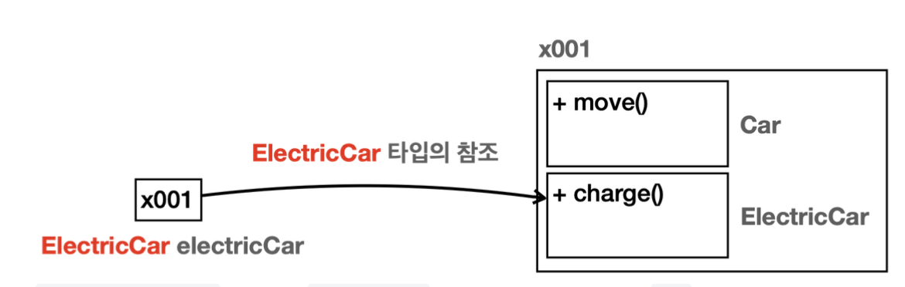
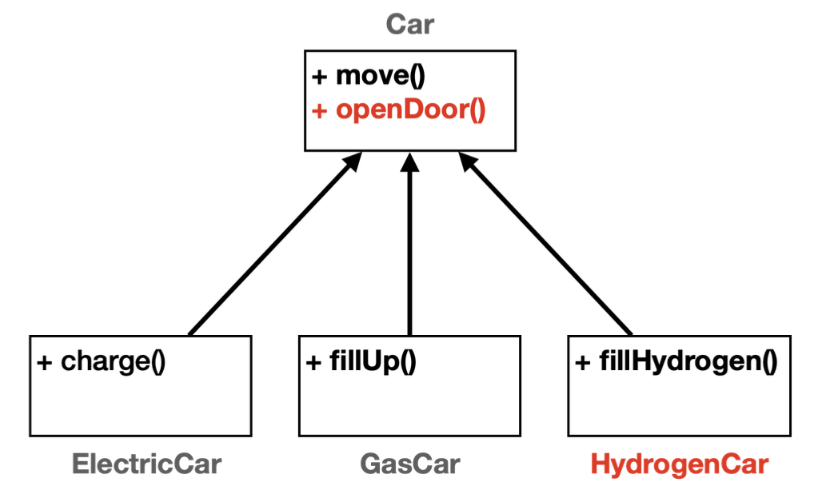
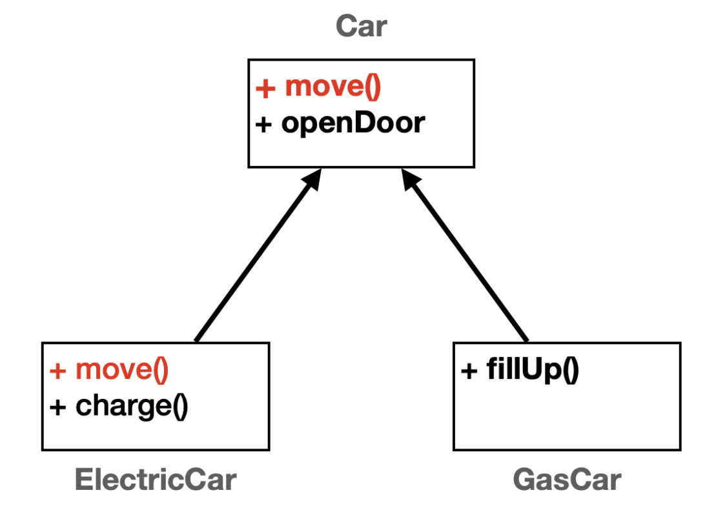
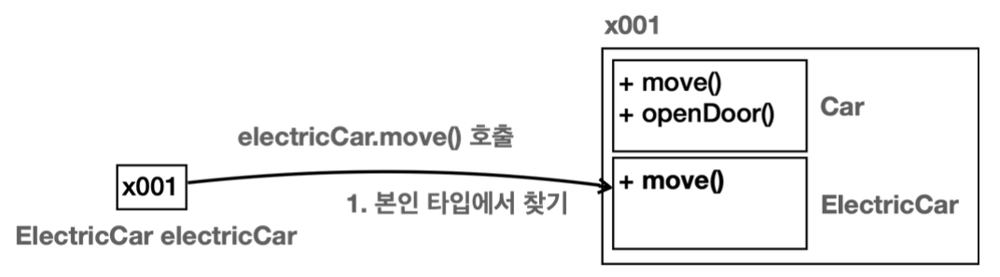
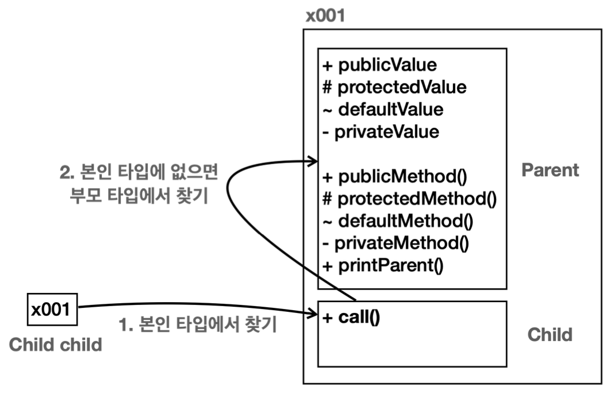
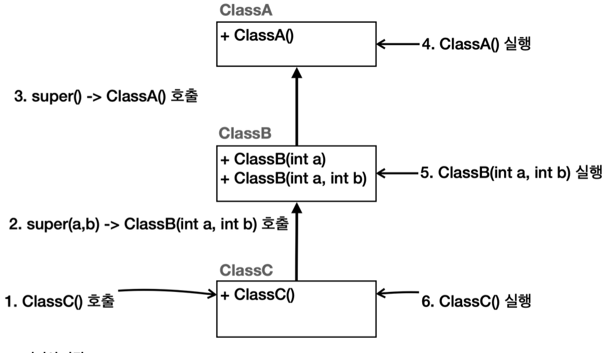
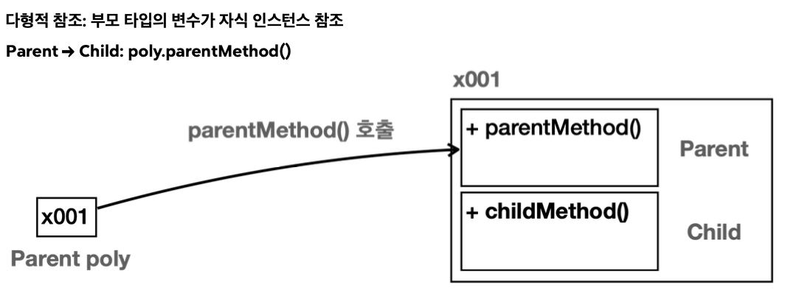
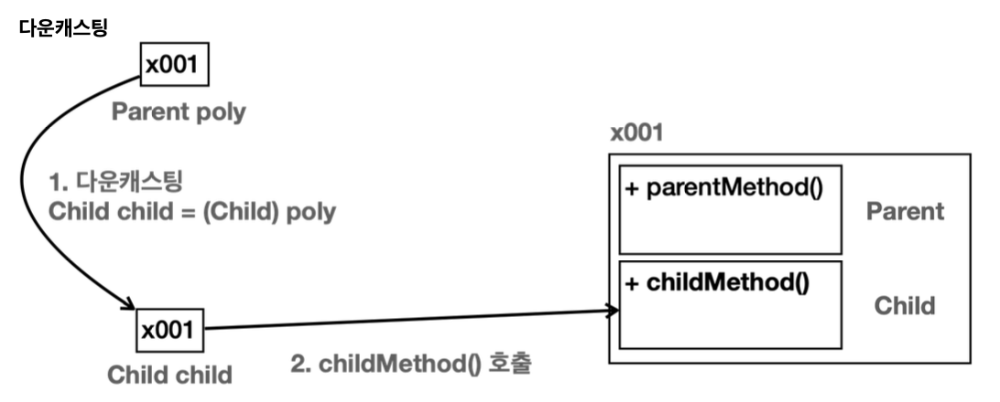
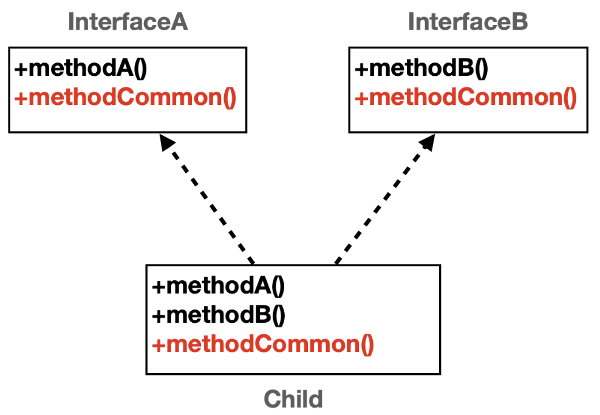
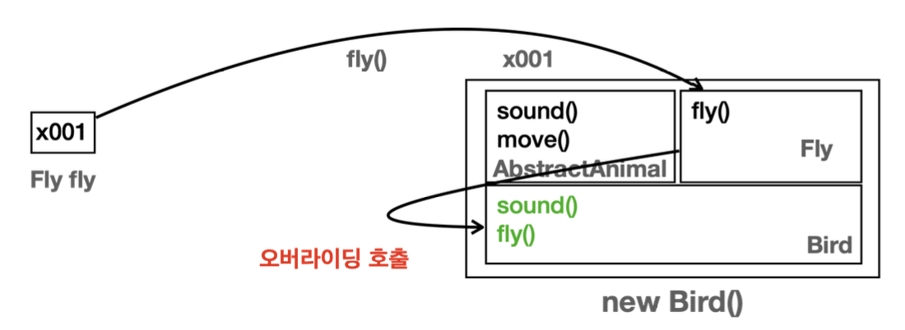

# 김영한의 실전 자바 - 기본편

## Chapter 10: 상속

### 상속이란?

기존 클래스의 필드와 메서드를 새로운 클래스에서 **재사용하게** 해주는 프로그래밍 요소

`extends`를 사용하고, 단 하나의 대상만을 선택할 수 있다.

- 부모 클래스 (슈퍼 클래스): 상속을 통해 자신의 필드, 메서드를 **제공**하는 클래스
- 자식 클래스 (서브 클래스): 부모 클래스로부터 필드, 메서드를 **상속**받는 클래스

상속 구조를 그릴 때 화살표 방향은 자식이 부모를 가리킴

부모는 자식의 코드를 알 수 없지만, 자식은 부모 코드를 알고(참조)있으므로

다이아몬드 문제: 여러 대상을 상속받게 되면 동일한 이름을 띄는 메서드를 호출할 때 어떤 메서드를 택해야 할지 알 수 없는 문제 → 자바는 다중 상속 금지 → 인터페이스 다중 구현으로 해당 문제 피함

### 상속 객체의 메모리 구조는 어떻게 구성되어 있을까?

핵심

- 상속 관계의 객체를 생성하면 그 내부에는 부모와 자식 모두 생성됨
- 상속 관계의 객체를 호출할 때, 대상 타입을 정해야 하고, 이 때 호출자의 타입을 통해 대상 타입을 찾음
- 현재 타입에서 기능을 찾지 못하면 상위 부모 타입으로 기능을 찾아서 실행. 기능을 찾지 못하면 컴파일 오류 발생



위와 같이 상속받은 객체 ElectricCar 객체를 할당하게 되면 ElectricCar와 그 객체가 상속받고있는 Car도 같이 구분되어 생성된다.

그럼 `move()`와 `charge()`를 호출할 때는 어떤 클래스를 기준으로 선택할까?

호출하는 변수(본인)의 타입(클래스)을 기준으로 선택

`electricCar.move()` 호출

1. 본인 타입(ElectricCar)에서 찾기
2. 본인 타입에서 없다면 부모 타입(Car)에서 찾기
    1. 찾았다면 메서드 호출
    2. 최상위 부모까지 찾아봤지만 없다면 컴파일 에러

`electricCar.charge()` 호출

1. 본인 타입(ElectricCar)에서 찾기
    1. 찾았다면 메서드 호출
    2. 없다면 컴파일 에러

### 그렇다면 왜 상속을 사용할까?



코드의 중복은 줄어들고 하위 클래스 코드의 확장은 편해짐

### 꼭 부모 클래스를 따라야할까?



부모 클래스의 메서드를 오버라이드하여 자식 클래스 내부에서 임의로 재지정 할 수 있음

`@Override`는 메서드가 정확히 오버라이드 했는지 검사하는 어노테이션

그렇다면 위에서 언급한 메모리 구조는



**오버라이드는 언제 가능할까?**

- 메서드 이름, 매개변수, 반환타입이 같아야 함 (단, 반환 타입이 하위 클래스 타입일 수 있음)
- 오버라이딩 메서드의 접근 제어자는 상위 클래스의 메서드보다 더 제한적이어서는 안됨
  (private → default(package-private) → protected → public)
- 오버라이딩 메서드는 상위 클래스의 메서드보다 더 많은 체크 예외를 throws로 선언할 수 없다. 하지만 더 적거나 같은 수의 예외 또는 하위 타입의 예외는 선언할 수 있다.
- static, final, private 키워드가 붙은 메서드는 오버라이딩 될 수 없다.
    - static: 클래스 레벨에서 작동 → 오버라이드 무의미
    - final: 재정의 금지
    - private: 어차피 하위 클래스에서 보이지 않음
- 생성자는 오버라이딩 할 수 없다.

### 부모 객체의 인스턴스와 메서드는 항상 노출돼야 할까?

- `private`: 상속 관계일지언정 모든 외부 호출을 막음
- `default(package-private)`: 같은 패키지 내에서 상속할 경우에만 호출 허용
- `protected`: 다른 패키지더라도 상속 관계라면 호출 허용
- `public`: 모든 외부 호출 허용

그럼 어떤 과정을 통해 객체 내부 노출을 지정할 수 있을까?



본인 타입에 존재하지 않으면 부모 타입에서 찾는데 이 때 접근 제어자가 영향을 줌

→ 객체 내부에는 자식과 부모의 영역이 구분되어 있기 때문

### 오버라이딩 당한 부모 클래스의 인스턴스와 메서드는 자식 클래스에서 어떻게 호출할까?

메모리 구조상 자식 클래스에서 찾으려는 인스턴스 혹은 메서드를 찾았다면 부모 클래스까지 탐색하지 않으므로 오버라이드 된 인스턴스와 메서드는 자식 클래스에서 호출할 수 없음

하지만 `super`를 통해 접근할 수 있음

`super`: 상위 클래스 참조

`this`: 자신 클래스 참조 (생략 가능)

### 그렇다면 자식 클래스에서 부모 클래스의 생성자 호출은 어떻게 할까?

`super()`를 통해 상위 클래스 생성자 호출할 수 있음



호출 순서: 자식 → 부모

실행 순서: 부모 → 자식

## Chapter 11-13: 다형성

### 다형성이란?

한 객체가 여러 타입의 객체로 취급될 수 있는 능력을 뜻함

보통 하나의 객체는 하나의 타입으로 고정돼있지만 다형성을 활용하면 다른 타입으로도 사용할 수 있음

다형성을 이해하기 위한 핵심 이론 두가지

- 다형적 참조
- 메서드 오버라이딩


### 다형적 참조란?

부모 타입의 변수가 자식 인스턴스를 참조



`Parent poly = new Child();`

위와 같이 생성하더라도 Parent와 Child 모두 생성됨

**부모는 자식을 담을 수 있다.**

메모리 구조상 자신의 클래스 타입을 먼저 탐색하므로 Parent 가리킴

하지만 poly는 childMethod로 접근하지 못함

→ 상속 관계는 부모 방향으로 찾아 올라갈 수 있지만 자식 방향으로 내려갈 수는 없으므로 컴파일 오류 발생 및 부모는 자식 클래스 내부를 알지 못하기 때문

### 그럼 다형적 참조를 할 때 자식 클래스의 인스턴스와 메서드에 접근할 순 없을까?

⇒ 다운 캐스팅(부모 클래스를 자식 클래스로 캐스팅)을 통해 해결

```java
Child child = (Child) poly;  // 타입 변환 시도
// 내부 동작: Child child = (Child) x001  // 참조값을 자식 타입으로 지정
child.childMethod();

((Child) poly).childMethod();  // 일시적 다운 캐스팅
```



반대로 업캐스팅은 생략

### 다운캐스팅은 상속 관계라면 아무때나 가능한걸까?

다형적 참조가 아닌 경우 다운 캐스팅할 때 오류 발생

```java
Parent parent = new Parent();  // 메모리 상에서 Parent만 생성됨
Child child = (Child) parent;  // Cast는 되더라도 Child 인스턴스 없음
child.childMethod();  // ClassCastException 런타임 오류
```

반대로 업캐스팅은 안전함

객체를 생성하면 해당 객체의 상위 클래스 모두 같이 생성되므로 안전함

따라서 업캐스팅은 안전하고 다운캐스팅은 조심해야 한다.

### 인스턴스의 타입을 확인하는 방법은 없을까?

instanceof를 통해 인스턴스의 타입 확인 가능

### 오버라이딩 된 메서드는 항상 우선권을 가진다.

다형적 참조를 통해 상속 관계의 객체에서 부모 클래스를 접근할 때 오버라이드 된 메서드가 있다면 부모 메서드에서 타겟 메서드를 발견했더라도 오버라이드 된 메서드를 우선적으로 호출

### 그럼 캐스팅을 하지 않으면 하위 클래스를 쓸 수 없는데 다형성을 왜 사용하는걸까?

- 중복되는 코드 제거

  공통적인 부분은 상위 클래스에서 선언하여 하위 클래스에 중복되는 코드를 제거할 수 있음

- 확장성의 편리

  하위 클래스를 확장하는데 편리함

- 유지보수의 편리

  공통적인 부분은 상위 클래스에서 다루고, 하위 클래스에서는 각 기능에 맞는 기능을 구현하므로 공통 사항에 변경 사항이 생겼을 시 상위 클래스에서만 수정하면 됨

- 여러 타입을 하나의 타입(상위 클래스)으로 사용 가능

  반복문 조건문 등 하나의 타입으로 관리가 가능하므로 코드가 간결해짐


### 추상 클래스란?

추상적인 개념을 제공하는 클래스.

실제 인스턴스가 존재하진 않고, 대신에 상속을 목적으로 사용되며 부모 클래스의 역할을 담당한다.

```java
abstract class AbstractClass {...}
```

### 추상 메서드란?

추상적인 개념을 제공하는 메서드

실체가 존재하지 않고 자식 클래스가 반드시 오버라이딩 해야 하는 메서드

```java
public abstract void sound();
```

### 그럼 일반 클래스를 상속받으면 되는데 굳이 추상 클래스/메서드로 만드는 이유가 뭘까?

**추상 클래스는 일반 클래스에서 제약이 추가된 클래스**

제약

- 일반 클래스 대신 추상 클래스를 사용하면 부모 클래스는 실체가 존재하지 않으므로 생성이 불가능
    - 부모 클래스의 인스턴스를 생성할 문제를 방지
        - 어떤 문제들?
            1. 미완성 설계 (불완전한 인스턴스) 방지
            2. 개발 단계에서 실수 방지

               부모 클래스를 추상 클래스로 명시함으로써 “이 클래스는 직접 사용하기 위한 게 아니라 반드시 상속 받아서 내용을 완성해야 한다.”라는 사실을 코드 수준에서 알림

- 추상 메서드를 통해 자식 클래스에서 메서드 오버라이드를 누락하는 일이 없게 함

### 한 클래스의 모든 메서드가 추상 메서드라면?

순수 추상 클래스

```java
public abstract class AbstractAnimal {
		public abstract void sound();
		public abstract void move();
}
```

특징

- 인스턴스를 생성할 수 없음
- 모든 메서드를 오버라이드 해야 함
- 주로 다형성을 위해 사용

### 상속은 부모의 기능을 물려받기 위함인데 순수 추상 클래스는 왜 존재할까?

인터페이스와 완전히 동일한 의미를 가짐

해당 클래스의 명확한 의도(규약)를 전달

“아, 이건 오직 메서드 시그니처만 정의돼 있고 구현이 전혀 없구나. 쓰려면 반드시 오버라이드해야 하는구나.”

### 인터페이스란?

순수 추상 클래스를 더 편리하게 사용할 수 있는 인터페이스라는 기능을 제공

- 인터페이스 메서드는 모두 `public abstract`이다.
- 인터페이스 멤버 변수는 `public static final`을 포함하였다고 간주
- 다중 구현(다중 상속) 지원

```java
public interface InterfaceAnimal {
		/*public static final*/ double MY_PI = 3.14;
		/*public abstract)*/ void sound();
}
```

### 인터페이스는 왜 쓸까?

- 제약: 인터페이스를 구현하는 곳에서 인터페이스 메서드를 반드시 구현하라는 제약을 줌
- 다중 구현: 상속은 단일 상속만 가능하지만 구현은 다중 구현까지 가능

### 다중 구현이란?



다중 상속은 다이아몬드 문제로 인해 자바에서 지원하지 않는다.

하지만 인터페이스는 바디가 존재하지 않으므로 다이아몬드 문제 상황이 발생되더라도 구현체는 자식 클래스에만 존재하고, 자식 클래스에서 호출되므로 문제가 발생하지 않는다.

### 다중 구현을 왜 사용할까?



- **다중 구현**은 한 클래스가 **여러 역할**(메서드 집합)을 **동시에 수행**할 수 있도록 해줌
- 복잡한 다중 상속 문제를 일으키지 않고도 **유연한 설계**와 **재사용성**, **확장성**을 제공하는 좋은 방법
- 따라서 “한 클래스가 다양한 인터페이스(추상 클래스)를 통해 여러 측면의 기능을 제공”해야 할 때, **다중 구현**이 적극 활용

### 객체 지향 프로그래밍이란?

프로그램을 유연하고 변경에 용이하게 만드는 기법

프로그램을 객체들의 모임으로 파악하고자 하는 것

각각의 객체는 메세지를 주고 받고 데이터를 처리하여 협력한다.

### How to OOP ?

역할과 구현을 분리

역할: 인터페이스

구현: 인터페이스를 구현한 클래스, 구현 객체

역할과 구분을 분리할 때 생기는 일

클라이언트는 대상의 역할만 알면 됨

== 내부 구조를 몰라도 됨

== 내부 구조가 변경되어도 영향 받지 않음

== 구현 대상 자체를 변경해도 영향 받지 않음

== 클라이언트를 변경하지 않고 서버의 구현 기능을 유연하게 변경할 수 있음

⇒ 유연하고 변경에 용이함

### OCP란?

Open Closed Principle 원칙

확장에는 열려있고 수정에는 닫혀있어야 한다.

Notion: https://speckle-sloth-e89.notion.site/16918ac4fa7b80ccb056cf82b883e247?pvs=74